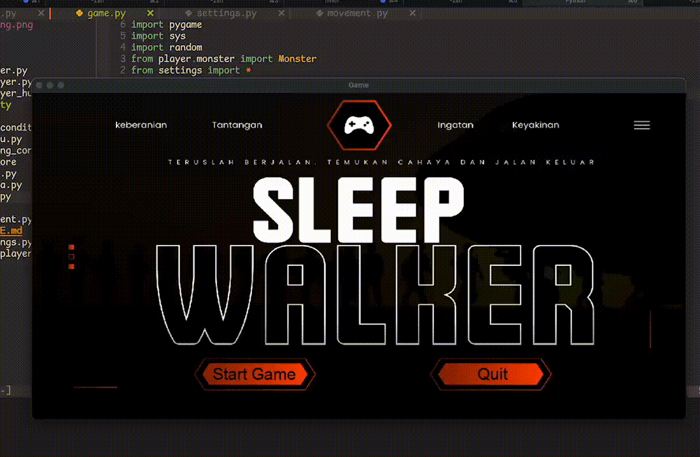

<div align="center">

# 🎮 SleepWalker
[](https://www.python.org/)
[](https://www.pygame.org/)
[]()


</div>

## 📖 Deskripsi Proyek

**Sleepwalker** adalah game semi horor bertema labirin gelap, di mana pemain harus berani melangkah dalam kegelapan untuk mencari lingkaran kemenangan. Pemain hanya dibekali cahaya senter terbatas yang bisa padam seiring waktu. Untuk bertahan, pemain harus menghindari monster, melewati rintangan seperti batu dan air, serta mengumpulkan baterai agar senter tetap menyala. Jika cahaya padam atau pemain tertangkap monster, maka permainan berakhir. Namun jika berhasil mencapai titik kemenangan, pemain bisa memilih untuk bermain kembali atau keluar dari permainan.

---

## 📦 Dependensi Paket

Aplikasi ini membutuhkan beberapa library berikut untuk dijalankan:

- **Python 3.x**
- **pygame** (engine utama game dan rendering)

Instalasi dapat dilakukan dengan:

```bash
pip install pygame
```

---

## ▶️ Cara Menjalankan Aplikasi & Cara Bermain

### Menjalankan Game

1. **Clone repository:**
    ```bash
    git clone https://github.com/syuhendar729/sleepwalker.git
    cd sleepwalker
    ```
3. **Jalankan game:**
    ```bash
    python main.py
    # atau
    python3 main.py
    ```
4. **Jalankan Unit Test (Opsional jika ingin tau apakah code benar)** 
    ```bash
    python -m unittest test_player_human.py
    # atau
    python3 -m unittest test_player_human.py
    ```


### Cara Bermain

- Tekan "Play Game" di Main Menu
- Tekan WASD untuk bergerak
- Cari Lingkaran Kemenangan untuk memenangkan Game
- Perhatikan waktu mundur untuk waktu sebelum senter mati
- Cari baterai senter untuk memperpanjang waktu energi senter tersebut

### Video Gameplay




---

## 📊 UML Class Diagram

Berikut adalah gambaran sederhana UML class diagram untuk proyek ini:

<div align="center">
  
</div>

---

## 👥 Kontributor Pengembangan

<div align="center">
<table>
  <tr>
    <td align="center">
      <a href="https://github.com/syuhendar729">
        
        <br />
        <sub><b>Syuhada Rantisi</b></sub>
      </a>
      <br />
      <sub>Project Manager and Programmer main loop game and all game condition</sub>
    </td>
    <td align="center">
      <a href="https://github.com/eichalelphindoginting">
        
        <br />
        <sub><b>Eichal Elpindo Ginting</b></sub>
      </a>
      <br />
      <sub>Programmer for obstacle and audio manager</sub>
    </td>
    <td align="center">
      <a href="https://github.com/RomualdusHaryPrabowo">
        
        <br />
        <sub><b>Romualdus Hary Prabowo</b></sub>
      </a>
      <br />
      <sub>Programmer for scene, main menu, win and lose scene, and UI designer for scene</sub>
    </td>
  </tr>
  <tr>
    <td align="center">
      <a href="https://github.com/lvywhisper">
        
        <br />
        <sub><b>Luthfi Daffa Nabila</b></sub>
      </a>
      <br />
      <sub>Programmer for player movement</sub>
    </td>
  </tr>
</table>
</div>

---

## 📚 Referensi

- [Pygame Documentation](https://www.pygame.org/docs/)
- [Python Official Documentation](https://docs.python.org/3/)

---

<div align="center">
  <i>SleepWalker</i>
</div>

